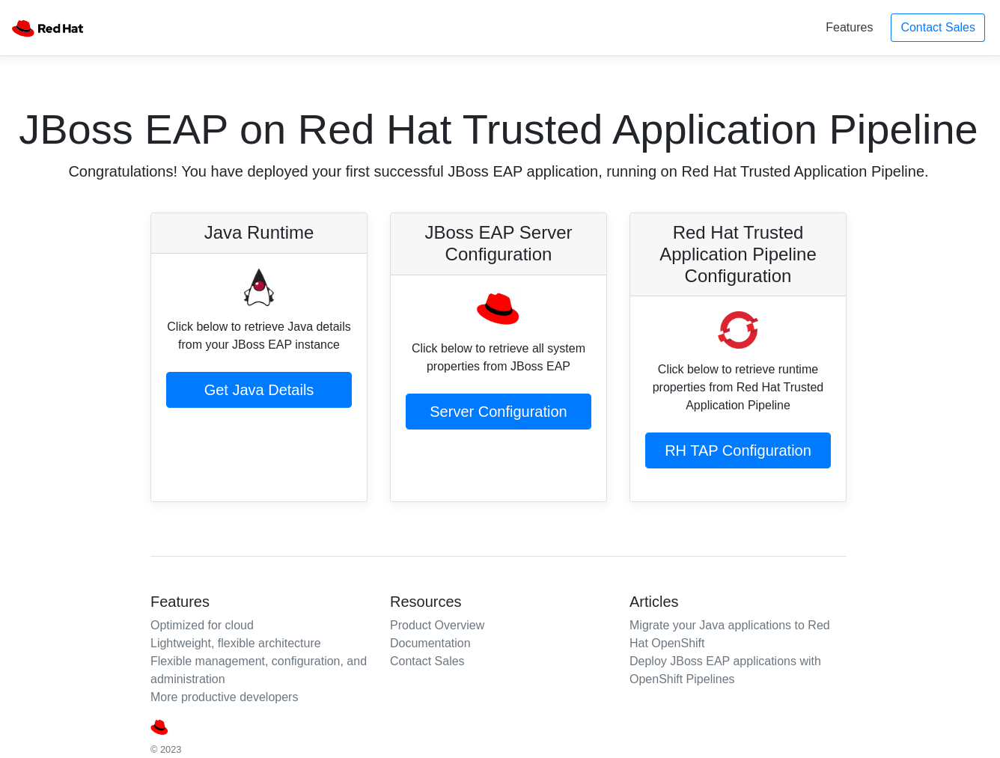

# Red Hat JBoss EAP on Red Hat Trusted Application Pipeline

This is a simple application that demonstrates a basic deployment of an application on Red Hat Trusted Application Pipeline

To deploy this on RHTAP, click on "Create application" and enter the url for this repo in the "Git repository URL" field and click on "Import code".  From the next screen, click on "Add secret".

In the "Select or enter name" field, enter a name for the secret e.g. `registry-redhat-io`

In the kef field enter: `.dockerconfigjson`

In the value field enter the following, replacing xxxx with a token created from https://access.redhat.com/terms-based-registry/#/accounts


```
{
  "auths": {
    "registry.redhat.io": {
      "auth": "xxxx"
    }
  }
}
```

Click on "Create" to create the secret, and then click on "Create application".  

The initial build will fail, until the secret is associated with the build pipeline.  To do this you will need to login to your RHTAP namespace using the OpenShift CLI.  Then run the following: `oc secrets link appstudio-pipeline registry-redhat-io`

Restart the RHTAP build, the application should successfully build and clicking on the external route should show the landing page:





